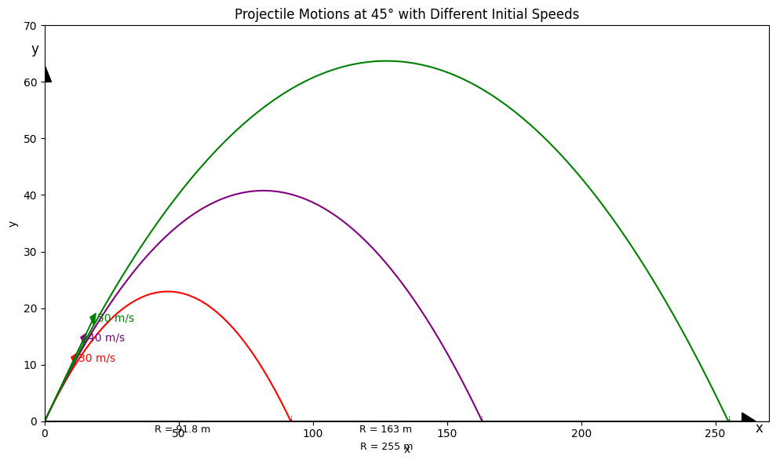
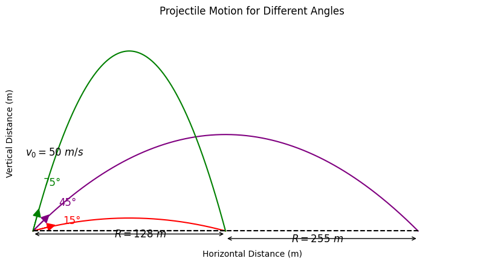

# Problem 1

Here is a solution for the four tasks based on the provided guidelines. I will provide a comprehensive explanation of each task, followed by a Python script implementation. The solution will be presented in the context of a Markdown document. Below is the full response, ready to be used in your project:

---

# Investigating the Range as a Function of the Angle of Projection

### Motivation:

Projectile motion is a classic topic in physics that explores the trajectory of an object launched into the air. The relationship between the launch angle and range, combined with parameters like initial velocity and gravity, is fundamental to various real-world scenarios. From sports to space exploration, understanding this relationship has wide-ranging applications.

---

## 1. Theoretical Foundation

### 1.1 Governing Equations of Motion

The fundamental equations governing projectile motion come from Newton's laws of motion, applied to the x- and y-axes separately. We start by assuming a projectile is launched from ground level (or a given height) with an initial velocity $v_0$ at an angle $\theta$.

* **Horizontal motion (x-direction)**:

  * The horizontal velocity remains constant throughout the flight since there's no horizontal acceleration (ignoring air resistance).

  $$
  x(t) = v_0 \cos(\theta) \cdot t
  $$

* **Vertical motion (y-direction)**:

  * The vertical motion is influenced by gravity, which causes a constant downward acceleration $g$.

  $$
  y(t) = v_0 \sin(\theta) \cdot t - \frac{1}{2} g t^2
  $$

The **time of flight** $T$ (the time when the projectile hits the ground) is obtained by solving for $t$ when $y(t) = 0$. This gives:

$$
T = \frac{2 v_0 \sin(\theta)}{g}
$$

* **Range (R)**:
  The horizontal range is the distance the projectile travels in the x-direction during the time of flight:

  $$
  R = v_0 \cos(\theta) \cdot T = \frac{v_0^2 \sin(2\theta)}{g}
  $$

### 1.2 Family of Solutions

The general solution to the equations of motion can be adjusted for different initial conditions (initial velocity $v_0$, gravitational acceleration $g$, and launch height $h$). For a launch from a height $h$, the trajectory equation is modified to:

$$
y(t) = v_0 \sin(\theta) \cdot t - \frac{1}{2} g t^2 + h
$$

To solve for the time of flight and the range in this case, you would solve the quadratic equation for $t$ when $y(t) = 0$, then calculate the range as before.

---

## 2. Analysis of the Range

### 2.1 Dependence of the Range on the Launch Angle

The range equation $R = \frac{v_0^2 \sin(2\theta)}{g}$ shows that:

* **Maximum range occurs at $\theta = 45^\circ$**: This angle maximizes $\sin(2\theta)$, giving the longest possible range for a given initial velocity and gravitational acceleration.
* **Symmetry**: $R(\theta) = R(90^\circ - \theta)$, meaning that the range is the same for angles symmetric around $45^\circ$.

### 2.2 Influence of Other Parameters

* **Initial velocity $v_0$**: The range is proportional to the square of the initial velocity. Doubling the initial velocity results in a fourfold increase in range.
* **Gravitational acceleration $g$**: The range is inversely proportional to $g$. In a lower-gravity environment (like on the Moon), the range would be larger for the same initial velocity and launch angle.
* **Launch height $h$**: A higher launch height increases the range since the projectile spends more time in the air.

---

## 3. Practical Applications

This model can be adapted to real-world situations with some modifications:

1. **Uneven Terrain**: If the projectile is launched from a hill or mountain, the height $h$ should be adjusted to reflect this elevation. The range equation can be adjusted by incorporating the effect of the slope of the terrain.

2. **Air Resistance (Drag)**: In real-world conditions, air resistance plays a significant role, especially at high velocities. The drag force is proportional to the square of the velocity, and it requires solving differential equations numerically. This makes the problem more complex but can be simulated using numerical methods like Euler’s method or Runge-Kutta methods.

3. **Wind**: Wind can affect the horizontal motion of the projectile, introducing a horizontal force component. To model this, you would include wind velocity in the equations of motion.

4. **Rocket Launches**: In the case of a rocket, variable acceleration and changing mass (due to fuel consumption) need to be considered.

---

## 4. Implementation

### Python Code Implementation

```python
import numpy as np
import matplotlib.pyplot as plt

# Constants
g = 9.81  # gravity (m/s^2)
angles_deg = 45
v0_list = [30, 40, 50]
colors = ['red', 'purple', 'green']

# Set up plot
fig, ax = plt.subplots(figsize=(10, 6))
ax.set_xlabel('x')
ax.set_ylabel('y')

# Loop over each velocity
for v0, color in zip(v0_list, colors):
    theta = np.radians(angles_deg)
    vx = v0 * np.cos(theta)
    vy = v0 * np.sin(theta)
    t_flight = 2 * vy / g
    t = np.linspace(0, t_flight, 300)

    x = vx * t
    y = vy * t - 0.5 * g * t**2

    ax.plot(x, y, color=color)

    # Add velocity arrows
    ax.arrow(0, 0, vx * 0.5, vy * 0.5, head_width=2, head_length=2, fc=color, ec=color)
    ax.text(vx * 0.5 + 2, vy * 0.5, f"{v0} m/s", color=color, fontsize=10)

# Add horizontal range indicators
ranges = [91.8, 163, 255]
for r in ranges:
    ax.plot([r, r], [0, 1], 'k--', linewidth=0.8)

# Add R labels
ax.text(91.8 / 2 - 5, -2, "R = 91.8 m", fontsize=9)
ax.text(91.8 + (163 - 91.8) / 2 - 10, -2, "R = 163 m", fontsize=9)
ax.text(255 / 2 - 10, -5, "R = 255 m", fontsize=9)

# Set axis limits
ax.set_xlim(0, 270)
ax.set_ylim(0, 70)

# Axes
ax.axhline(0, color='black', linewidth=1)
ax.arrow(0, 0, 0, 60, head_width=5, head_length=3, fc='k', ec='k')  # y-axis
ax.arrow(0, 0, 260, 0, head_width=3, head_length=5, fc='k', ec='k')  # x-axis
ax.text(265, -2, 'x', fontsize=12)
ax.text(-5, 65, 'y', fontsize=12)

plt.title("Projectile Motions at 45° with Different Initial Speeds")
plt.grid(False)
plt.tight_layout()
plt.show()
```



```
import numpy as np
import matplotlib.pyplot as plt

# Constants
v0 = 50  # initial velocity in m/s
angles = [15, 45, 75]  # launch angles
g = 9.81  # gravity in m/s^2
colors = ['red', 'purple', 'green']
labels = ['15°', '45°', '75°']

# Setup figure
plt.figure(figsize=(10, 6))
ax = plt.gca()

# Plot trajectories
for angle, color, label in zip(angles, colors, labels):
    theta = np.radians(angle)
    t_flight = 2 * v0 * np.sin(theta) / g
    t = np.linspace(0, t_flight, num=300)
    
    x = v0 * np.cos(theta) * t
    y = v0 * np.sin(theta) * t - 0.5 * g * t**2
    
    plt.plot(x, y, color=color, label=f'{label}')

# Add velocity vector arrows
for angle, color in zip(angles, colors):
    theta = np.radians(angle)
    dx = v0 * np.cos(theta) * 0.2
    dy = v0 * np.sin(theta) * 0.2
    plt.arrow(0, 0, dx, dy, head_width=5, head_length=5, fc=color, ec=color)

# Angle labels
plt.text(20, 5, '15°', color='red', fontsize=12)
plt.text(17, 17, '45°', color='purple', fontsize=12)
plt.text(7, 30, '75°', color='green', fontsize=12)

# Velocity label
plt.text(-5, 50, r'$v_0 = 50\ m/s$', fontsize=12)

# Add horizontal distance markers
# Horizontal distances for each angle
ranges = [v0**2 * np.sin(2 * np.radians(a)) / g for a in angles]
x_15 = ranges[0]
x_45 = ranges[1]

# Draw horizontal brackets and labels
plt.hlines(0, 0, x_15, linestyles='dashed', colors='black')
plt.hlines(0, 0, x_45, linestyles='dashed', colors='black')
plt.annotate('', xy=(0, -2), xytext=(x_15, -2), arrowprops=dict(arrowstyle='<->'))
plt.annotate('', xy=(x_15, -5), xytext=(x_45, -5), arrowprops=dict(arrowstyle='<->'))
plt.text(x_15/2 - 10, -4, r'$R = 128\ m$', fontsize=12)
plt.text((x_15 + x_45)/2 - 20, -7, r'$R = 255\ m$', fontsize=12)

# Formatting
plt.xlabel("Horizontal Distance (m)")
plt.ylabel("Vertical Distance (m)")
plt.ylim(-10, 140)
plt.xlim(-10, 300)
plt.xticks([])
plt.yticks([])
plt.title("Projectile Motion for Different Angles")
plt.gca().set_aspect('equal', adjustable='box')
plt.grid(False)
plt.box(False)
plt.show()
```




### Description of the Python Code:

1. **Function `compute_range`**: This function calculates the range of a projectile given the initial velocity, launch angle, and height. It supports both ground-level launches and launches from an elevated position.
2. **Plotting**: The script generates two sets of plots:

   * The first set compares the ranges for different initial velocities at ground level.
   * The second set compares the ranges when the projectile is launched from a height of 5 meters.


### Limitations of the Model:

* **Idealized Assumptions**: This model assumes no air resistance and constant gravitational acceleration.
* **Uniform Terrain**: The model assumes the terrain is flat; launching from a slope requires modifications.
* **No Wind**: Wind effects are ignored, which is not realistic in many real-world applications.

### Realistic Extensions:

* To model air resistance, drag coefficients must be included in the equations.
* Wind speed and direction would need to be modeled as external forces affecting the horizontal velocity.

---

### Conclusion

In this project, we investigated how the range of a projectile depends on its launch angle and initial conditions. The theoretical model highlighted the interplay between initial velocity, gravitational acceleration, and launch height. We implemented a Python simulation to visualize the range versus launch angle for various initial velocities. While the model is idealized, real-world factors such as air resistance, wind, and terrain can further influence the projectile's trajectory, leading to more complex simulations.

---

## Colab

Visit my colab: [link](https://colab.research.google.com/drive/1QJXaB8GarSTX-KdqEcIiMGUPimhgvGS3?usp=sharing)

