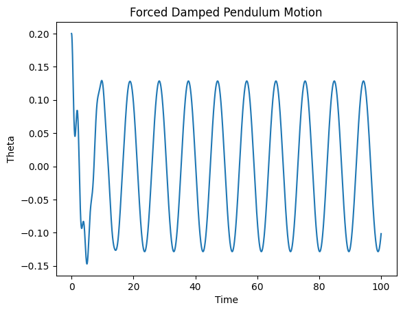

# Problem 2

Here is a comprehensive, structured response to your project on **“Investigating the Dynamics of a Forced Damped Pendulum”**, including theoretical derivations, simulation guidelines, and deliverable suggestions. This version is suitable for use in a Markdown document or Python notebook.

---

# 📘 Investigating the Dynamics of a Forced Damped Pendulum

## 🧠 Motivation

The forced damped pendulum offers a rich canvas to explore nonlinear dynamics, showcasing behaviors from predictable harmonic oscillations to chaotic motion. These dynamics are not just academic curiosities—they underpin real-world systems in engineering, physics, and nature, including suspension bridges, driven electronic circuits, and even human biomechanics.

---

## 1️⃣ Theoretical Foundation

### ⚙️ Governing Equation

The general equation for a forced, damped pendulum is:

$$
\frac{d^2\theta}{dt^2} + b\frac{d\theta}{dt} + \frac{g}{L} \sin\theta = A\cos(\omega t)
$$

Where:

* $\theta$: Angular displacement
* $b$: Damping coefficient
* $g$: Acceleration due to gravity
* $L$: Length of the pendulum
* $A$: Driving force amplitude
* $\omega$: Driving frequency

### 🧮 Small-Angle Approximation

For small $\theta$, we use $\sin(\theta) \approx \theta$, yielding:

$$
\frac{d^2\theta}{dt^2} + b\frac{d\theta}{dt} + \frac{g}{L} \theta = A\cos(\omega t)
$$

This is a linear nonhomogeneous second-order differential equation, with a general solution consisting of:

* **Homogeneous solution** (transient behavior)
* **Particular solution** (steady-state behavior)

#### ✅ Resonance

Resonance occurs when $\omega \approx \sqrt{\frac{g}{L}}$. At this point, the pendulum absorbs maximum energy from the driver, and oscillation amplitudes peak (limited by damping).

---

## 2️⃣ Analysis of Dynamics

### 🔁 Parameters Affecting Motion

* **Damping Coefficient $b$**:

  * Low $b$: oscillations persist or grow (if driven).
  * High $b$: oscillations quickly decay.

* **Driving Amplitude $A$**:

  * Larger $A$ can drive the system into **nonlinear** or **chaotic** regimes.

* **Driving Frequency $\omega$**:

  * Near resonance: increased amplitude.
  * Far from resonance: suppressed oscillations.

### 🌀 Regular vs. Chaotic Behavior

* **Regular motion**: Periodic, predictable.
* **Chaotic motion**: Sensitive to initial conditions, non-periodic, strange attractors emerge.

> **Key Tool**: *Poincaré sections* reveal chaos by showing where the system is at regular intervals of the driving period.

---

## 3️⃣ Practical Applications

* **Energy harvesting**: Resonant mechanical systems tuned to vibrations (e.g., piezoelectric devices).
* **Suspension bridges**: External forcing (e.g., wind) can cause resonant oscillations (e.g., Tacoma Narrows).
* **RLC circuits**: Analogous differential equation governs voltage/current behavior in driven, damped circuits.

---

## 4️⃣ Implementation – Python Simulation

### 🔧 Numerical Method

Use **Runge-Kutta (RK4)** or `scipy.integrate.solve_ivp` to numerically integrate:

$$
\begin{cases}
\frac{d\theta}{dt} = \omega \\
\frac{d\omega}{dt} = -b\omega - \frac{g}{L}\sin(\theta) + A\cos(\omega_{\text{drive}} t)
\end{cases}
$$

### 📊 Visualizations

* **Time series plots** of $\theta(t)$ to observe resonance and chaos.
* **Phase portraits** $(\theta, \omega)$ to visualize periodicity and attractors.
* **Poincaré sections** $(\theta, \omega)$ at discrete times $t = nT$, $T = \frac{2\pi}{\omega_{\text{drive}}}$.
* **Bifurcation diagrams**: Plot final $\theta$ values vs. driving amplitude/frequency to reveal transitions.

---


## 🧩 Sample Python Snippet

```python
import numpy as np
import matplotlib.pyplot as plt
from scipy.integrate import solve_ivp

# Parameters
g, L = 9.81, 1.0
b, A, omega_drive = 0.5, 1.2, 2/3

def pendulum(t, y):
    theta, omega = y
    dtheta_dt = omega
    domega_dt = -b*omega - (g/L)*np.sin(theta) + A*np.cos(omega_drive*t)
    return [dtheta_dt, domega_dt]

# Solve
t_span = (0, 100)
y0 = [0.2, 0.0]
t_eval = np.linspace(*t_span, 10000)
sol = solve_ivp(pendulum, t_span, y0, t_eval=t_eval)

# Plot
plt.plot(t_eval, sol.y[0])
plt.xlabel("Time")
plt.ylabel("Theta")
plt.title("Forced Damped Pendulum Motion")
plt.show()
```


