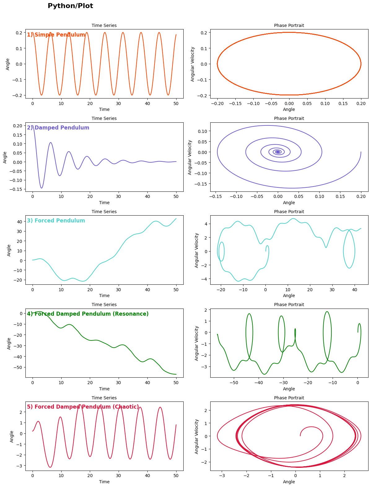

# Problem 2

Here is a comprehensive, structured response to your project on **“Investigating the Dynamics of a Forced Damped Pendulum”**, including theoretical derivations, simulation guidelines, and deliverable suggestions. This version is suitable for use in a Markdown document or Python notebook.

---

# 📘 Investigating the Dynamics of a Forced Damped Pendulum

## 🧠 Motivation

The forced damped pendulum offers a rich canvas to explore nonlinear dynamics, showcasing behaviors from predictable harmonic oscillations to chaotic motion. These dynamics are not just academic curiosities—they underpin real-world systems in engineering, physics, and nature, including suspension bridges, driven electronic circuits, and even human biomechanics.

---

## 1️⃣ Theoretical Foundation

### ⚙️ Governing Equation

The general equation for a forced, damped pendulum is:

$$
\frac{d^2\theta}{dt^2} + b\frac{d\theta}{dt} + \frac{g}{L} \sin\theta = A\cos(\omega t)
$$

Where:

* $\theta$: Angular displacement
* $b$: Damping coefficient
* $g$: Acceleration due to gravity
* $L$: Length of the pendulum
* $A$: Driving force amplitude
* $\omega$: Driving frequency

### 🧮 Small-Angle Approximation

For small $\theta$, we use $\sin(\theta) \approx \theta$, yielding:

$$
\frac{d^2\theta}{dt^2} + b\frac{d\theta}{dt} + \frac{g}{L} \theta = A\cos(\omega t)
$$

This is a linear nonhomogeneous second-order differential equation, with a general solution consisting of:

* **Homogeneous solution** (transient behavior)
* **Particular solution** (steady-state behavior)

#### ✅ Resonance

Resonance occurs when $\omega \approx \sqrt{\frac{g}{L}}$. At this point, the pendulum absorbs maximum energy from the driver, and oscillation amplitudes peak (limited by damping).

---

## 2️⃣ Analysis of Dynamics

### 🔁 Parameters Affecting Motion

* **Damping Coefficient $b$**:

  * Low $b$: oscillations persist or grow (if driven).
  * High $b$: oscillations quickly decay.

* **Driving Amplitude $A$**:

  * Larger $A$ can drive the system into **nonlinear** or **chaotic** regimes.

* **Driving Frequency $\omega$**:

  * Near resonance: increased amplitude.
  * Far from resonance: suppressed oscillations.

### 🌀 Regular vs. Chaotic Behavior

* **Regular motion**: Periodic, predictable.
* **Chaotic motion**: Sensitive to initial conditions, non-periodic, strange attractors emerge.

> **Key Tool**: *Poincaré sections* reveal chaos by showing where the system is at regular intervals of the driving period.

---

## 3️⃣ Practical Applications

* **Energy harvesting**: Resonant mechanical systems tuned to vibrations (e.g., piezoelectric devices).
* **Suspension bridges**: External forcing (e.g., wind) can cause resonant oscillations (e.g., Tacoma Narrows).
* **RLC circuits**: Analogous differential equation governs voltage/current behavior in driven, damped circuits.

---

## 4️⃣ Implementation – Python Simulation

### 🔧 Numerical Method

Use **Runge-Kutta (RK4)** or `scipy.integrate.solve_ivp` to numerically integrate:

$$
\begin{cases}
\frac{d\theta}{dt} = \omega \\
\frac{d\omega}{dt} = -b\omega - \frac{g}{L}\sin(\theta) + A\cos(\omega_{\text{drive}} t)
\end{cases}
$$

### 📊 Visualizations

* **Time series plots** of $\theta(t)$ to observe resonance and chaos.
* **Phase portraits** $(\theta, \omega)$ to visualize periodicity and attractors.
* **Poincaré sections** $(\theta, \omega)$ at discrete times $t = nT$, $T = \frac{2\pi}{\omega_{\text{drive}}}$.
* **Bifurcation diagrams**: Plot final $\theta$ values vs. driving amplitude/frequency to reveal transitions.

---


## 🧩 Sample Python Snippet

````
import numpy as np
import matplotlib.pyplot as plt
from scipy.integrate import solve_ivp

# Pendulum differential equation
def pendulum(t, y, b, A, omega):
    theta, omega_dot = y
    dtheta_dt = omega_dot
    domega_dt = -b * omega_dot - np.sin(theta) + A * np.cos(omega * t)
    return [dtheta_dt, domega_dt]

# Time span and evaluation points
t_span = (0, 50)
t_eval = np.linspace(*t_span, 1000)
initial_conditions = [0.2, 0.0]  # [theta0, omega0]

# Scenario definitions
scenarios = [
    {"title": "1) Simple Pendulum", "b": 0.0, "A": 0.0, "omega": 0.0, "color": "orangered"},
    {"title": "2) Damped Pendulum", "b": 0.2, "A": 0.0, "omega": 0.0, "color": "slateblue"},
    {"title": "3) Forced Pendulum", "b": 0.0, "A": 1.2, "omega": 2/3, "color": "mediumturquoise"},
    {"title": "4) Forced Damped Pendulum (Resonance)", "b": 0.1, "A": 1.2, "omega": 2/3, "color": "green"},
    {"title": "5) Forced Damped Pendulum (Chaotic)", "b": 0.5, "A": 1.5, "omega": 0.9, "color": "crimson"},
]

# Set up the plot
fig, axs = plt.subplots(len(scenarios), 2, figsize=(12, 16))
fig.suptitle("Python/Plot", fontsize=16, fontweight='bold', ha='left', x=0.125)

for i, scenario in enumerate(scenarios):
    # Solve ODE
    sol = solve_ivp(
        pendulum, t_span, initial_conditions, t_eval=t_eval,
        args=(scenario["b"], scenario["A"], scenario["omega"])
    )
    
    theta = sol.y[0]
    omega_vals = sol.y[1]

    # Time series plot
    axs[i, 0].plot(sol.t, theta, color=scenario["color"])
    axs[i, 0].set_title("Time Series", fontsize=10)
    axs[i, 0].set_xlabel("Time")
    axs[i, 0].set_ylabel("Angle")

    # Phase portrait plot
    axs[i, 1].plot(theta, omega_vals, color=scenario["color"])
    axs[i, 1].set_title("Phase Portrait", fontsize=10)
    axs[i, 1].set_xlabel("Angle")
    axs[i, 1].set_ylabel("Angular Velocity")

    # Add title inside subplot
    axs[i, 0].text(0.01, 0.9, scenario["title"], transform=axs[i, 0].transAxes,
                   fontsize=12, fontweight='bold', color=scenario["color"])

# Adjust layout
plt.tight_layout(rect=[0, 0, 1, 0.97])
plt.show()
````

