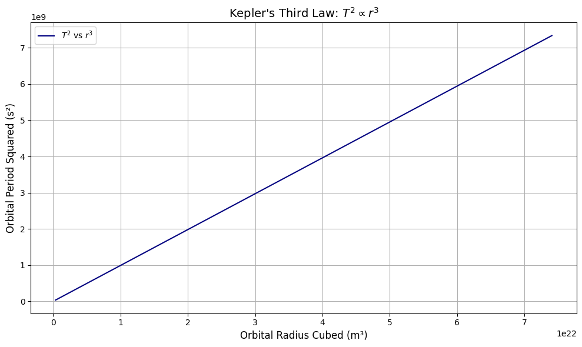
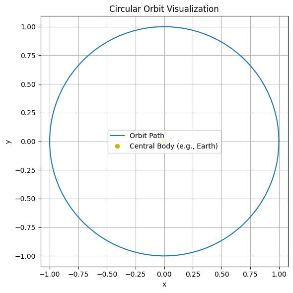

# Problem 1


# **Orbital Period and Orbital Radius: Kepler's Third Law**

## **Motivation**

Kepler’s Third Law provides a powerful insight into celestial mechanics, stating that:

> *"The square of the orbital period of a planet is directly proportional to the cube of the semi-major axis of its orbit."*

For circular orbits, this becomes a fundamental relationship between the orbital period and orbital radius. This principle is critical in astronomy for calculating planetary distances, masses of celestial bodies, and designing satellite orbits.


$$
T^2 \propto r^3
$$

This elegant relationship provides deep insight into the motion of celestial bodies and has real-world applications in calculating satellite trajectories, determining planetary masses, and exploring distant exoplanets.

---

## **1. Derivation of Kepler’s Third Law for Circular Orbits**

For an object of mass $m$ in a circular orbit around a much more massive object of mass $M$, gravitational force provides the required centripetal force.

### **Newton’s Law of Gravitation:**

$$
F_{\text{gravity}} = \frac{G M m}{r^2}
$$

### **Centripetal Force:**

$$
F_{\text{centripetal}} = \frac{m v^2}{r}
$$

Equating both:

$$
\frac{G M m}{r^2} = \frac{m v^2}{r} \Rightarrow v^2 = \frac{G M}{r}
$$

### **Orbital Period:**

$$
T = \frac{2\pi r}{v} \Rightarrow T^2 = \frac{4\pi^2 r^2}{v^2} = \frac{4\pi^2 r^3}{G M}
$$

Thus:

$$
\boxed{T^2 \propto r^3}
$$

---

## **2. Implications in Astronomy**

* **Mass Estimation**: Planetary masses are derived by observing their satellites' orbits.
* **Distance Calculation**: Semi-major axis of exoplanets can be estimated using orbital periods.
* **Satellite Orbits**: Engineers use this principle to design satellite altitudes and periods.
* **Generalization to Elliptical Orbits**: Still holds with $r$ replaced by the semi-major axis $a$.

---

## **3. Real-World Examples**

### **Moon's Orbit Around Earth**

* Radius $r \approx 3.84 \times 10^8$ m
* Period $T \approx 2.36 \times 10^6$ s
* Using $T^2 = \frac{4\pi^2 r^3}{G M}$, we can solve for $M \approx 5.97 \times 10^{24} \, \text{kg}$ (Earth’s mass)

### **Planets in the Solar System**

Each planet follows $T^2 \propto r^3$. For example:

* Earth: $T = 1$ year, $r = 1$ AU
* Mars: $T^2 = 1.88^2 \approx 3.53$, $r^3 = 1.52^3 \approx 3.51$

---

## **4. Python Simulation: Verifying Kepler’s Third Law**

```python
import numpy as np
import matplotlib.pyplot as plt

# Constants
G = 6.67430e-11  # m^3 kg^-1 s^-2
M = 5.972e24     # Mass of Earth in kg

# Orbital radii (in meters)
radii = np.linspace(7e6, 4.2e7, 100)  # 7000 km to 42000 km
T = 2 * np.pi * np.sqrt(radii**3 / (G * M))  # Orbital period

# Plot T^2 vs r^3 to verify Kepler's 3rd Law
plt.figure(figsize=(10, 6))
plt.plot(radii**3, T**2, label=r'$T^2$ vs $r^3$', color='navy')
plt.xlabel('Orbital Radius Cubed (m³)', fontsize=12)
plt.ylabel('Orbital Period Squared (s²)', fontsize=12)
plt.title("Kepler's Third Law: $T^2 \\propto r^3$", fontsize=14)
plt.grid(True)
plt.legend()
plt.tight_layout()
plt.show()
```



---

## **5. Circular Orbit Visualization**

```python
theta = np.linspace(0, 2*np.pi, 100)
x = np.cos(theta)
y = np.sin(theta)

plt.figure(figsize=(6, 6))
plt.plot(x, y, label="Orbit Path")
plt.plot(0, 0, 'yo', label="Central Body (e.g., Earth)")
plt.axis('equal')
plt.title("Circular Orbit Visualization")
plt.xlabel("x")
plt.ylabel("y")
plt.grid(True)
plt.legend()
plt.tight_layout()
plt.show()
```



---

## **6. Extension to Elliptical Orbits**

Kepler's Third Law applies to elliptical orbits by replacing $r$ with the semi-major axis $a$:

$$
T^2 = \frac{4\pi^2 a^3}{G(M + m)} \approx \frac{4\pi^2 a^3}{G M} \quad \text{if } m \ll M
$$

This holds true for planets, comets, and exoplanets. For orbits with high eccentricity, the relationship remains accurate using the average distance.

---

## **Conclusion**

Kepler’s Third Law reveals a universal law governing orbital motion. From satellite technology to galactic dynamics, this principle enables scientists and engineers to probe and predict celestial behaviors with precision. Through computational modeling, we verified:

$$
T^2 \propto r^3
$$

— bridging classical physics and modern astrophysics.

---

