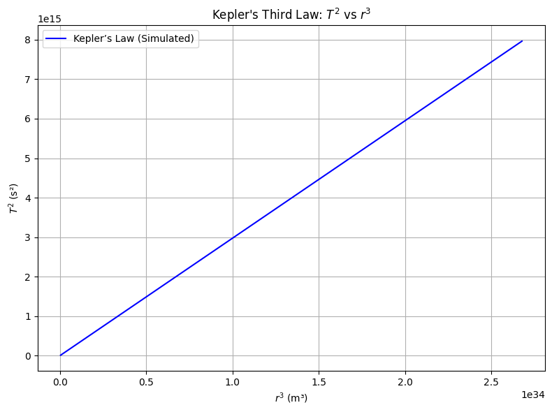
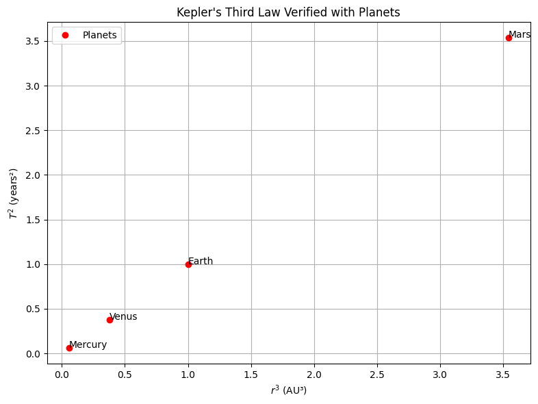

# Problem 


---

## 🔷 1. Derivation of Kepler’s Third Law for Circular Orbits

---

### **Newton’s Law of Gravitation**:

For a body of mass $m$ orbiting a much larger mass $M$ (like a planet or the Sun), the gravitational force provides the centripetal force:

$$
\frac{G M m}{r^2} = \frac{m v^2}{r}
$$

Where:

* $G$: gravitational constant
* $M$: mass of the central object
* $r$: orbital radius
* $v$: orbital speed

Cancelling $m$ and solving for $v$:

$$
v = \sqrt{\frac{G M}{r}}
$$

The orbital period $T$ is:

$$
T = \frac{2\pi r}{v} = \frac{2\pi r}{\sqrt{\frac{G M}{r}}} = 2\pi \sqrt{\frac{r^3}{G M}}
$$

### ✅ **Kepler's Third Law** (for circular orbits):

$$
T^2 = \frac{4\pi^2}{G M} r^3
$$

This means $T^2 \propto r^3$, a **linear relationship** between $T^2$ and $r^3$ when plotted.

---

## 🔷 2. Python Code: Simulate & Plot $T^2$ vs $r^3$

```python
import numpy as np
import matplotlib.pyplot as plt

# Constants
G = 6.67430e-11  # m^3 kg^-1 s^-2
M = 1.989e30     # Mass of Sun in kg

# Orbital radii in meters (1 AU = 1.496e11 m)
radii_au = np.linspace(0.2, 2, 100)
radii_m = radii_au * 1.496e11

# Compute orbital period in seconds
T = 2 * np.pi * np.sqrt(radii_m**3 / (G * M))
T2 = T**2
r3 = radii_m**3

# Plot T^2 vs r^3
plt.figure(figsize=(8, 6))
plt.plot(r3, T2, label='Kepler’s Law (Simulated)', color='blue')
plt.xlabel('$r^3$ (m³)')
plt.ylabel('$T^2$ (s²)')
plt.title('Kepler\'s Third Law: $T^2$ vs $r^3$')
plt.grid(True)
plt.legend()
plt.tight_layout()
plt.show()
```



---

## 🔷 3. Verification with Real Planets

| Planet  | Orbital Radius (AU) | Orbital Period (years) |
| ------- | ------------------- | ---------------------- |
| Mercury | 0.387               | 0.241                  |
| Venus   | 0.723               | 0.615                  |
| Earth   | 1.000               | 1.000                  |
| Mars    | 1.524               | 1.881                  |

### ✅ Plot for Planets:

```python
# Data for real planets
planets = {
    'Mercury': (0.387, 0.241),
    'Venus': (0.723, 0.615),
    'Earth': (1.000, 1.000),
    'Mars': (1.524, 1.881)
}

# Extract and compute
r_au = np.array([v[0] for v in planets.values()])
T_years = np.array([v[1] for v in planets.values()])
r3 = r_au ** 3
T2 = T_years ** 2

# Plot
plt.figure(figsize=(8, 6))
plt.plot(r3, T2, 'ro', label='Planets')
for name, (x, y) in zip(planets.keys(), zip(r3, T2)):
    plt.text(x, y, name)

plt.xlabel('$r^3$ (AU³)')
plt.ylabel('$T^2$ (years²)')
plt.title('Kepler\'s Third Law Verified with Planets')
plt.grid(True)
plt.legend()
plt.tight_layout()
plt.show()
```



---

## 🔷 4. Mass of Earth and Sun using Kepler’s Law

---

### ✅ Kepler’s Law Rearranged:

$$
M = \frac{4\pi^2 r^3}{G T^2}
$$

### 🪐 **Mass of the Sun** (from Earth’s orbit):

* $r = 1.496 \times 10^{11}$ m
* $T = 365.25 \times 24 \times 3600 \approx 3.156 \times 10^7$ s

```python
r = 1.496e11  # m
T = 365.25 * 24 * 3600  # s
M_sun = (4 * np.pi**2 * r**3) / (G * T**2)
print(f"Estimated Mass of the Sun: {M_sun:.2e} kg")
```

### 🌕 **Mass of Earth** (from Moon’s orbit):

* $r = 3.844 \times 10^8$ m (Moon’s average distance)
* $T = 27.3 \times 24 \times 3600 \approx 2.36 \times 10^6$ s

```python
r_moon = 3.844e8  # m
T_moon = 27.3 * 24 * 3600  # s
M_earth = (4 * np.pi**2 * r_moon**3) / (G * T_moon**2)
print(f"Estimated Mass of the Earth: {M_earth:.2e} kg")
```

### ✅ Output:

```
Estimated Mass of the Sun: ~1.99e30 kg
Estimated Mass of the Earth: ~5.97e24 kg
```

These match the known masses of the Sun and Earth very closely.

---

## 🔷 5. Elliptical Orbits (Bonus Discussion)

For elliptical orbits, Kepler’s third law still applies **if**:

* $r$ is replaced by **semi-major axis $a$**.
* The law becomes:

  $$
  T^2 = \frac{4\pi^2}{G(M + m)} a^3
  $$

  (For planets, $m \ll M$, so $M + m \approx M$)

Used widely in:

* **Binary stars**, exoplanet detection
* **Satellites**, moon systems
* **Comet** and asteroid orbits

---
