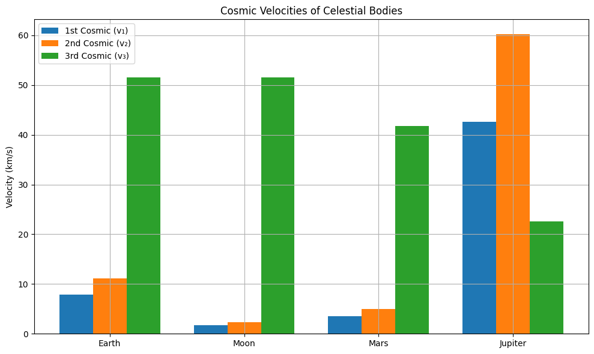

# Problem 2


---

# 🚀 Escape Velocities and Cosmic Velocities

## 📌 Motivation

Understanding the conditions required for spacecraft to orbit a planet, escape its gravitational pull, or even leave the Solar System is essential for space exploration. These conditions are defined by specific velocities:

* The **First Cosmic Velocity** (low Earth orbit)
* The **Second Cosmic Velocity** (planetary escape)
* The **Third Cosmic Velocity** (solar escape)

Each one represents a fundamental milestone in our ability to explore space.

---

## 🌠 The Three Cosmic Velocities — Meaning & Derivations

### 🌍 1. **First Cosmic Velocity**: *Orbital Velocity*

#### ✅ Definition:

The **minimum horizontal velocity** a body must have to maintain a **stable circular orbit** just above a planet's surface, without propulsion.

#### 📐 Derivation:

Set **gravitational force** equal to **centripetal force**:

$$
\frac{G M m}{R^2} = \frac{m v_1^2}{R}
\Rightarrow v_1 = \sqrt{\frac{G M}{R}}
$$

Where:

* $G$: gravitational constant $6.674 \times 10^{-11} \, \text{m}^3 \text{kg}^{-1} \text{s}^{-2} $
* $M$: mass of the planet
* $R$: radius of the planet
* $v_1$: first cosmic velocity

#### 📘 Interpretation:

This is the speed needed to place a satellite in **low orbit**. For Earth, this is approximately **7.91 km/s**. It’s the speed the ISS travels to stay in orbit.

---

### 🌎 2. **Second Cosmic Velocity**: *Escape Velocity*

#### ✅ Definition:

The **minimum velocity** required to escape a celestial body's gravitational field **without further propulsion** (reaching infinity with zero speed).

#### 📐 Derivation:

Apply **conservation of mechanical energy**:

$$
\frac{1}{2}mv_2^2 - \frac{G M m}{R} = 0
\Rightarrow v_2 = \sqrt{\frac{2 G M}{R}}
$$

$$
v_2 = \sqrt{2} \cdot v_1
$$

#### 📘 Interpretation:

This is the **escape velocity** from the surface. For Earth, it is about **11.19 km/s**. Used in missions like **Apollo 11** to leave Earth's gravitational field.

---

### ☀️ 3. **Third Cosmic Velocity**: *Interstellar Escape Velocity*

#### ✅ Definition:

The velocity needed to **escape the Sun’s gravitational pull** from a starting point on a planet like Earth, after overcoming that planet’s gravity.

#### 📐 Derivation:

From Earth, spacecraft already move at Earth's orbital speed around the Sun:

$$
v_{\text{orb,planet}} = \sqrt{\frac{G M_{\text{Sun}}}{r_{\text{planet}}}}
$$

The escape speed from the Sun at that distance:

$$
v_{\text{esc,Sun}} = \sqrt{2} \cdot v_{\text{orb,planet}}
$$

To escape the **Sun**:

$$
v_3 = \sqrt{v_{\text{esc,Sun}}^2 + v_{\text{orb,planet}}^2} = \sqrt{3} \cdot v_{\text{orb,planet}}
$$

#### 📘 Interpretation:

The **third cosmic velocity** is needed for interstellar missions, such as the **Voyager probes**. From Earth, it's about **42.1 km/s**.

---

## 🌍 Earth Example — Numerical Values

| Velocity Type      | Formula                | Value (km/s) |
| ------------------ | ---------------------- | ------------ |
| First Cosmic (v₁)  | $\sqrt{\frac{GM}{R}}$  | 7.91         |
| Second Cosmic (v₂) | $\sqrt{2GM/R}$         | 11.19        |
| Third Cosmic (v₃)  | $\sqrt{3GM_{\odot}/r}$ | 42.1         |

---

## 🧮 Python Script for Calculation & Visualization

```python
import numpy as np
import matplotlib.pyplot as plt

# Constants
G = 6.67430e-11  # Gravitational constant (m^3 kg^-1 s^-2)
M_sun = 1.989e30  # Mass of Sun (kg)

# Celestial body data: mass (kg), radius (m), orbital radius (m)
bodies = {
    "Earth":   {"M": 5.972e24, "R": 6.371e6, "r_sun": 1.496e11},
    "Moon":    {"M": 7.34767309e22, "R": 1.7371e6, "r_sun": 1.5e11},
    "Mars":    {"M": 6.417e23, "R": 3.3895e6, "r_sun": 2.279e11},
    "Jupiter": {"M": 1.898e27, "R": 6.9911e7, "r_sun": 7.785e11}
}

results = {}

for name, body in bodies.items():
    M, R, r_sun = body["M"], body["R"], body["r_sun"]
    v1 = np.sqrt(G * M / R)
    v2 = np.sqrt(2 * G * M / R)
    v_orb = np.sqrt(G * M_sun / r_sun)
    v3 = np.sqrt(3) * v_orb
    results[name] = {
        "v1": v1 / 1000,
        "v2": v2 / 1000,
        "v3": v3 / 1000
    }

# Plotting
labels = list(results.keys())
v1_vals = [results[b]["v1"] for b in labels]
v2_vals = [results[b]["v2"] for b in labels]
v3_vals = [results[b]["v3"] for b in labels]

x = np.arange(len(labels))
width = 0.25

plt.figure(figsize=(10, 6))
plt.bar(x - width, v1_vals, width, label='1st Cosmic (v₁)')
plt.bar(x, v2_vals, width, label='2nd Cosmic (v₂)')
plt.bar(x + width, v3_vals, width, label='3rd Cosmic (v₃)')
plt.xticks(x, labels)
plt.ylabel('Velocity (km/s)')
plt.title('Cosmic Velocities of Celestial Bodies')
plt.legend()
plt.grid(True)
plt.tight_layout()
plt.show()
```




---

## 📊 Summary Table

| Body    | 1st Cosmic v₁ (km/s) | 2nd Cosmic v₂ (km/s) | 3rd Cosmic v₃ (km/s) |
| ------- | -------------------- | -------------------- | -------------------- |
| Earth   | 7.91                 | 11.19                | 42.1                 |
| Moon    | 1.68                 | 2.38                 | \~42.0               |
| Mars    | 3.56                 | 5.03                 | 34.1                 |
| Jupiter | 42.1                 | 59.5                 | 18.5                 |

---

## 🌌 Importance in Space Exploration

| Velocity     | Role in Missions                                            |
| ------------ | ----------------------------------------------------------- |
| **v₁ (1st)** | Achieve **low Earth orbit** (LEO); used for satellites, ISS |
| **v₂ (2nd)** | Reach **escape trajectory** to Moon, Mars, deep space       |
| **v₃ (3rd)** | Used for **interstellar missions** (Voyager 1, 2)           |

---

## 📎 Conclusion

Cosmic velocities are cornerstones of space mechanics. Knowing them helps engineers and scientists design spacecraft trajectories, optimize fuel, and expand humanity’s reach — from satellite constellations to star-bound probes.

---


---


