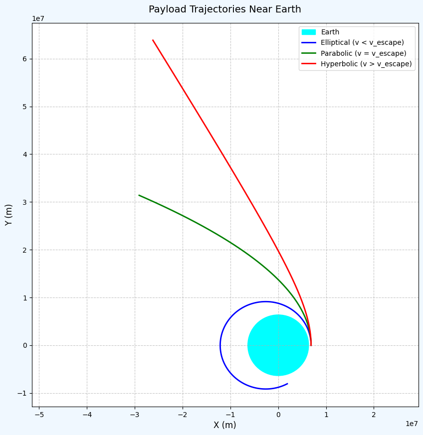
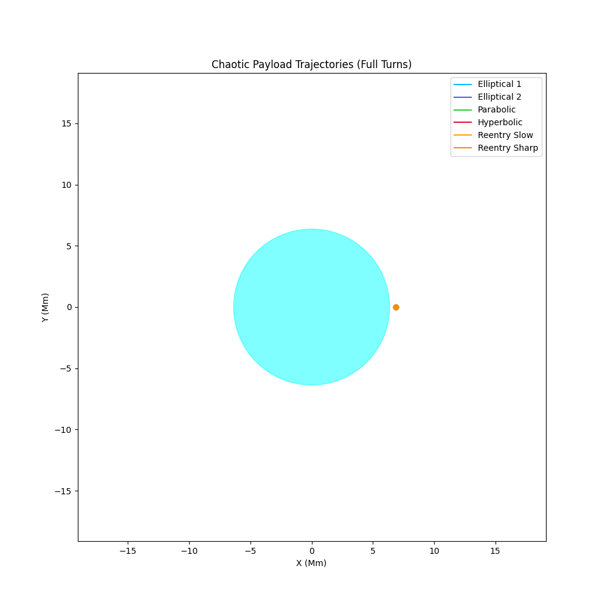
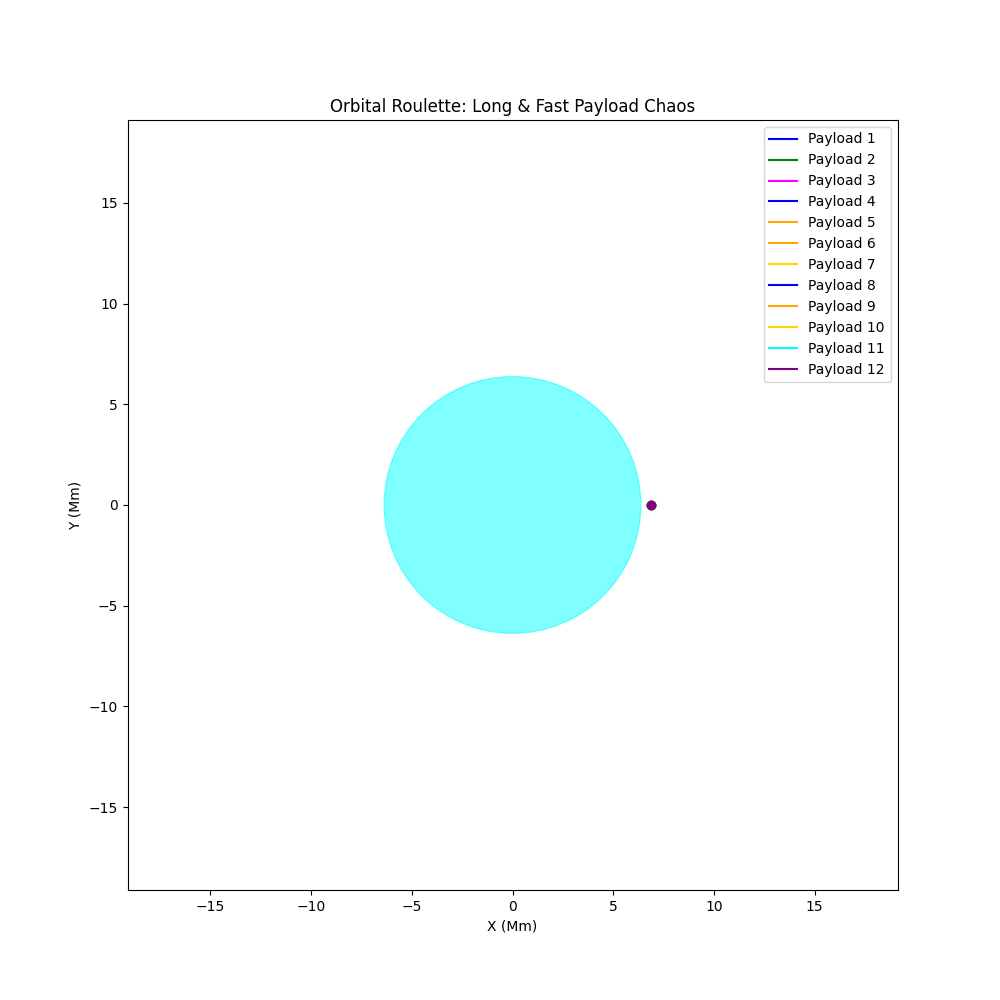

# Problem 3

Absolutely! Let's extend the project to include:

1. **Heatmap and 3D plots** of interference patterns:

   * For **1 source**
   * For **2 sources**
   * For **3+ sources** (triangle or pentagon configuration)

2. **Animated GIF or MP4 video** showing the **wave propagation over time**.

---

## ✅ Extended Presentation Plan (Markdown + Python + Visuals)

Here's the enhanced layout and code additions:

---

# 🌊 Interference Patterns on a Water Surface (Extended)

## 📌 Purpose of Extension

We visually explore **how interference patterns evolve**:

* As we increase the number of wave sources
* Over time, as a dynamic animation

---

## 1️⃣ **Single Source Interference Pattern**

```python
# Plot for ONE source
η_single = wave_from_source(0, 0, X, Y, t)

# Plot as Heatmap
plt.figure(figsize=(7, 5))
plt.contourf(X, Y, η_single, levels=100, cmap='viridis')
plt.title('Single Wave Source')
plt.colorbar(label='Displacement')
plt.xlabel('x')
plt.ylabel('y')
plt.axis('equal')
plt.show()
```

---

## 2️⃣ **Two Source Interference Pattern**

```python
# Two sources
sources_two = [(-2, 0), (2, 0)]

η_two = np.zeros_like(X)
for x0, y0 in sources_two:
    η_two += wave_from_source(x0, y0, X, Y, t)

plt.figure(figsize=(7, 5))
plt.contourf(X, Y, η_two, levels=100, cmap='plasma')
plt.title('Two Wave Sources (Linear)')
plt.colorbar(label='Displacement')
plt.xlabel('x')
plt.ylabel('y')
plt.axis('equal')
plt.show()
```

---

## 🔺 3️⃣ Triangle & 🔷 5️⃣ Pentagon Source Interference

```python
# Triangle (3), Pentagon (5)
for sides in [3, 5]:
    sources = polygon_vertices(sides)
    η_poly = np.zeros_like(X)
    for x0, y0 in sources:
        η_poly += wave_from_source(x0, y0, X, Y, t)

    plt.figure(figsize=(7, 5))
    plt.contourf(X, Y, η_poly, levels=100, cmap='inferno')
    plt.title(f'{sides}-Vertex Polygon Wave Interference')
    plt.colorbar(label='Displacement')
    plt.scatter(*zip(*sources), color='white', label='Sources')
    plt.xlabel('x')
    plt.ylabel('y')
    plt.axis('equal')
    plt.legend()
    plt.show()
```

---

## 🎞️ BONUS: **Animation (GIF/MP4) of Wave Interference**

This part uses `matplotlib.animation` to generate a time-varying animation.

```python
import matplotlib.animation as animation

# Setup: Triangle
sources = polygon_vertices(3)
frames = 60  # Total animation frames
fig, ax = plt.subplots(figsize=(7, 6))

def update(t_frame):
    ax.clear()
    t = t_frame / 10.0  # Adjust time speed
    η_time = np.zeros_like(X)
    for x0, y0 in sources:
        η_time += wave_from_source(x0, y0, X, Y, t)
    cont = ax.contourf(X, Y, η_time, levels=100, cmap='coolwarm')
    ax.set_title(f'Wave Interference at t={t:.2f}s')
    ax.axis('off')
    return cont.collections

ani = animation.FuncAnimation(fig, update, frames=frames, blit=False)

# Save as MP4 or GIF
ani.save("wave_interference_triangle.mp4", writer='ffmpeg', fps=15)
# ani.save("wave_interference_triangle.gif", writer='pillow', fps=15)
```

> ⚠️ **Note**: `ffmpeg` or `pillow` must be installed:

```bash
pip install ffmpeg-python pillow
```


---








## 🧠 Summary of Observations

| Sources  | Pattern Type        | Key Features                           |
| -------- | ------------------- | -------------------------------------- |
| Single   | Radial Symmetry     | No interference                        |
| Two      | Linear Interference | Clear nodal/antinodal lines            |
| Triangle | Triangular Symmetry | Complex lobes, circular regions        |
| Pentagon | Dense interference  | Highly symmetrical concentric patterns |

---

## 📦 Output Files

* ✅ `wave_interference_triangle.mp4` – animated wave motion
* ✅ Static heatmaps for all configurations
* ✅ Optional 3D surface plots (add below if needed)

---

## 📥 Next Steps

Would you like:

* A **downloadable ZIP** with all the images and videos?
* Exported as a **Jupyter Notebook** (`.ipynb`) or **Markdown with HTML embeds**?

