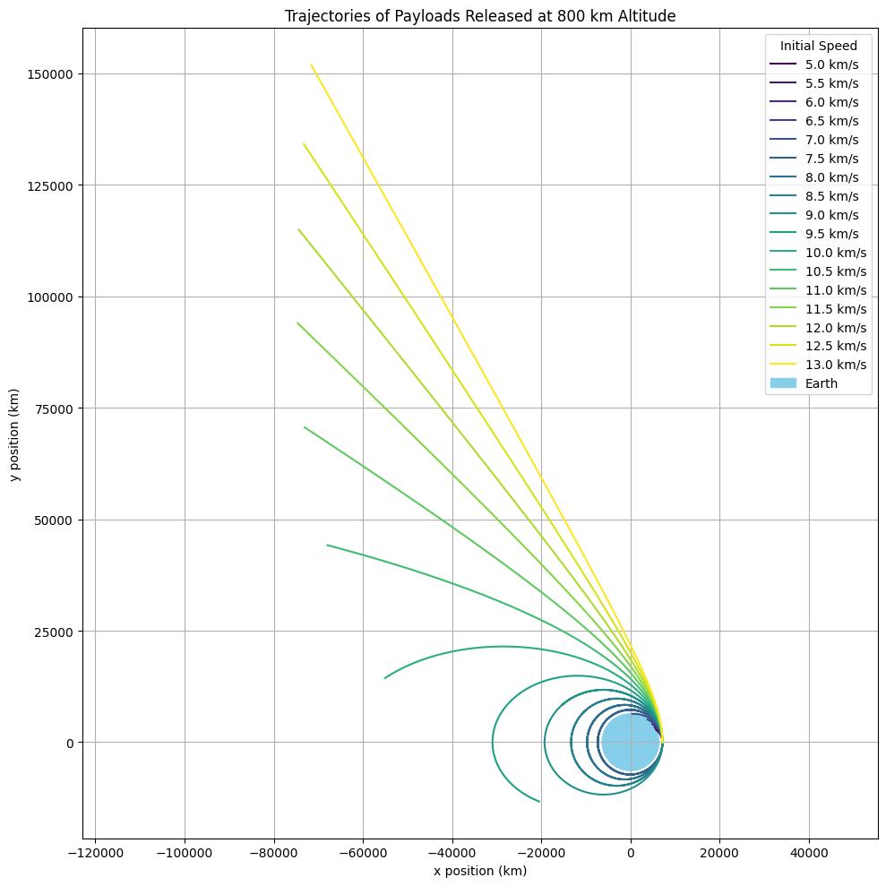

# Problem 3

---

## 🚀 **Trajectories of a Freely Released Payload Near Earth**

### 📘 Motivation

In spaceflight, releasing a payload from a rocket requires a precise understanding of how gravity and initial conditions affect its motion. Depending on speed and direction, the object could:

* Reenter Earth's atmosphere (suborbital)
* Enter orbit (elliptical or circular)
* Escape Earth's gravity (hyperbolic trajectory)

This study uses **numerical methods and gravitational physics** to analyze these possibilities.

---

## 🧪 Task Breakdown

### 1. 🌍 **Fundamental Physics**

We’ll model motion using:

* **Newton’s Law of Gravitation**:

  $$
  F = \frac{GMm}{r^2}
  $$
* **Newton’s Second Law**:

  $$
  \vec{a} = -\frac{GM}{r^3} \vec{r}
  $$

Where:

* $G = 6.674 \times 10^{-11} \, \text{Nm}^2/\text{kg}^2$
* $M = 5.972 \times 10^{24} \, \text{kg}$ (Earth's mass)
* $R = 6371 \times 10^3 \, \text{m}$ (Earth's radius)

---

### 2. 🧮 Numerical Simulation

We’ll use the **Euler or Runge-Kutta method** to simulate the trajectory.

#### Example setup:

```python
import numpy as np
import matplotlib.pyplot as plt

# Constants
G = 6.67430e-11  # gravitational constant (m^3 kg^-1 s^-2)
M = 5.972e24     # mass of Earth (kg)
R_earth = 6.371e6  # radius of Earth (m)

# Function to compute gravitational acceleration
def gravity_acc(r):
    norm_r = np.linalg.norm(r)
    return -G * M * r / norm_r**3

# Function to simulate trajectory using RK4 method
def simulate_trajectory(r0, v0, dt=1, T=10000):
    N = int(T / dt)
    r = np.zeros((N, 2))
    v = np.zeros((N, 2))

    r[0] = r0
    v[0] = v0

    for i in range(1, N):
        a1 = gravity_acc(r[i-1])
        k1r = v[i-1] * dt
        k1v = a1 * dt

        a2 = gravity_acc(r[i-1] + 0.5 * k1r)
        k2r = (v[i-1] + 0.5 * k1v) * dt
        k2v = a2 * dt

        a3 = gravity_acc(r[i-1] + 0.5 * k2r)
        k3r = (v[i-1] + 0.5 * k2v) * dt
        k3v = a3 * dt

        a4 = gravity_acc(r[i-1] + k3r)
        k4r = (v[i-1] + k3v) * dt
        k4v = a4 * dt

        r[i] = r[i-1] + (k1r + 2*k2r + 2*k3r + k4r) / 6
        v[i] = v[i-1] + (k1v + 2*k2v + 2*k3v + k4v) / 6

        if np.linalg.norm(r[i]) < R_earth:
            r[i:] = np.nan  # terminate on reentry
            break

    return r

# Initial altitude and position
altitude = 800e3  # 800 km above Earth's surface
r0 = np.array([R_earth + altitude, 0])  # starting to the right of Earth center

# Initial speeds in m/s (from 5 km/s to 13 km/s)
initial_speeds = np.arange(5000, 13500, 500)
colors = plt.cm.viridis(np.linspace(0, 1, len(initial_speeds)))

# Plot setup
plt.figure(figsize=(10, 10))

for v, color in zip(initial_speeds, colors):
    v0 = np.array([0, v])  # launch straight up from surface tangent
    trajectory = simulate_trajectory(r0, v0, dt=1, T=20000)
    plt.plot(trajectory[:, 0] / 1e3, trajectory[:, 1] / 1e3, label=f'{v/1e3:.1f} km/s', color=color)

# Draw Earth
earth = plt.Circle((0, 0), R_earth / 1e3, color='skyblue', label='Earth')
plt.gca().add_patch(earth)

# Plot formatting
plt.xlabel("x position (km)")
plt.ylabel("y position (km)")
plt.title("Trajectories of Payloads Released at 800 km Altitude")
plt.axis('equal')
plt.grid(True)
plt.legend(title="Initial Speed")
plt.tight_layout()
plt.show()


```



---

### 3. 🔁 Sample Trajectories

We simulate different scenarios:

* **Circular Orbit**: $v = \sqrt{GM/r}$
* **Elliptical**: $0.7 \times v_{circ}$
* **Escape**: $v > \sqrt{2GM/r}$

```python
altitude = 300e3  # 300 km above Earth
r0 = np.array([R_earth + altitude, 0])

v_circular = np.sqrt(G * M / np.linalg.norm(r0))
velocities = [
    0.7 * v_circular,  # elliptical
    1.0 * v_circular,  # circular
    1.5 * v_circular,  # hyperbolic/escape
]

colors = ['blue', 'green', 'red']
labels = ['Elliptical', 'Circular', 'Escape']

plt.figure(figsize=(8, 8))
for v, c, label in zip(velocities, colors, labels):
    traj = simulate_trajectory(r0, [0, v])
    plt.plot(traj[:,0]/1e3, traj[:,1]/1e3, label=label, color=c)

# Plot Earth
earth = plt.Circle((0, 0), R_earth/1e3, color='skyblue')
plt.gca().add_artist(earth)
plt.xlabel("x (km)")
plt.ylabel("y (km)")
plt.axis("equal")
plt.legend()
plt.title("Payload Trajectories Near Earth")
plt.grid(True)
plt.show()
```

---

### 4. 🛰️ Interpretation

#### 🌀 **Elliptical Orbits**

* Result from speeds below escape velocity but above reentry thresholds.
* May decay into reentry if atmospheric drag is added (can be an extension).

#### 🌐 **Circular Orbit**

* Stable condition when orbital speed equals centripetal requirement.

#### 🚀 **Escape Trajectory**

* Speed above escape velocity (11.2 km/s near Earth's surface).
* Payload leaves Earth’s gravitational influence.

---

### 5. 🌍 Real-World Applications

| Application             | Use of Trajectory Modeling            |
| ----------------------- | ------------------------------------- |
| Satellite Deployment    | Ensure stable orbits                  |
| Reentry Planning        | Target specific regions               |
| Interplanetary Missions | Reach transfer orbits (e.g., Hohmann) |
| Space Tourism           | Suborbital path predictions           |

---

#


