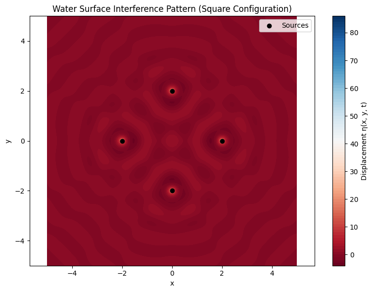

# Problem 1


---

# 🌊 Interference Patterns on a Water Surface

## 🔍 Motivation

Interference patterns occur when multiple wave sources interact, resulting in regions where wave amplitudes reinforce (constructive interference) or cancel (destructive interference) each other. On a water surface, such patterns provide a clear, intuitive way to understand wave superposition.

By analyzing the interference patterns generated by sources at the vertices of a regular polygon, we gain insight into fundamental wave phenomena using simple visual and computational tools.

---

## 📌 Task Summary

* **Polygon Choice**: Regular square (4 vertices)
* **Wave Properties**: Coherent sources with same amplitude, frequency, and wavelength
* **Goal**: Visualize and explain the resulting wave interference pattern

---

## 📐 Wave Model

Each source emits a circular wave described by:

$$
\eta_i(x, y, t) = \frac{A}{r_i} \cdot \cos(k r_i - \omega t + \phi_i)
$$

Where:

* $r_i = \sqrt{(x - x_i)^2 + (y - y_i)^2}$ — distance from source $i$
* $A$ — amplitude
* $k = \frac{2\pi}{\lambda}$ — wave number
* $\omega = 2\pi f$ — angular frequency
* $\phi_i$ — phase (same for coherent sources)

The total displacement is:

$$
\eta_{\text{sum}}(x, y, t) = \sum_{i=1}^{N} \eta_i(x, y, t)
$$

---

## 🧪 Python Simulation

```python
import numpy as np
import matplotlib.pyplot as plt

# Wave parameters
A = 1          # amplitude
λ = 1          # wavelength
f = 1          # frequency
ω = 2 * np.pi * f
k = 2 * np.pi / λ
ϕ = 0          # initial phase

# Simulation grid
x = np.linspace(-5, 5, 500)
y = np.linspace(-5, 5, 500)
X, Y = np.meshgrid(x, y)

# Define polygon vertices (square, centered at origin)
def polygon_vertices(n_sides, radius=2):
    return [(radius * np.cos(2 * np.pi * i / n_sides),
             radius * np.sin(2 * np.pi * i / n_sides)) for i in range(n_sides)]

vertices = polygon_vertices(4)  # Square
t = 0  # Snapshot at time t

# Calculate the total wave
η_sum = np.zeros_like(X)
for (x0, y0) in vertices:
    R = np.sqrt((X - x0)**2 + (Y - y0)**2)
    # Avoid division by zero at source
    R[R == 0] = 1e-6
    η = (A / R) * np.cos(k * R - ω * t + ϕ)
    η_sum += η

# Plotting
plt.figure(figsize=(8, 6))
plt.contourf(X, Y, η_sum, levels=100, cmap='RdBu')
plt.colorbar(label='Displacement η(x, y, t)')
plt.scatter(*zip(*vertices), color='black', marker='o', label='Sources')
plt.title("Water Surface Interference Pattern (Square Configuration)")
plt.xlabel("x")
plt.ylabel("y")
plt.legend()
plt.axis('equal')
plt.tight_layout()
plt.show()
```

---



## 🧠 Observations & Analysis

* **Constructive Interference**: Occurs where the crests of multiple waves align. In the plot, these show as bright or dark bands depending on phase alignment.
* **Destructive Interference**: Where crests meet troughs, resulting in cancellation. Appears as neutral-colored regions between intense bands.
* **Symmetry**: The interference pattern reflects the symmetry of the square—regular polygon sources lead to rotational and reflectional symmetry in the wave field.
* **Fringes**: The alternating high/low amplitude bands resemble interference fringes, similar to light in double-slit experiments.

---

## 📈 Extensions

To deepen the exploration:

* Try **triangular or pentagonal** configurations by changing `polygon_vertices(3)` or `polygon_vertices(5)`.
* Vary the **initial phases** $\phi_i$ to explore effects of phase shifts.
* Animate the pattern over time by varying `t` in a loop.

---

## 📄 Conclusion

This project illustrates how interference patterns on a water surface emerge from coherent wave sources arranged in geometric configurations. Using computational tools allows for detailed, dynamic investigation of wave phenomena, reinforcing key concepts in wave physics through visual and interactive exploration.


