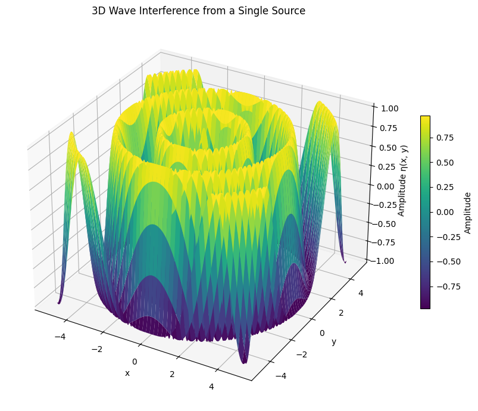
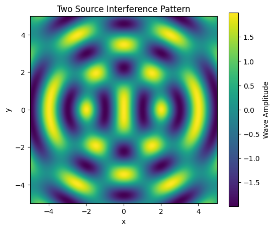
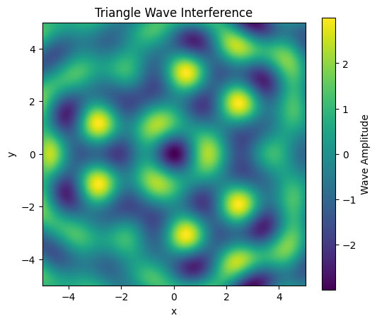
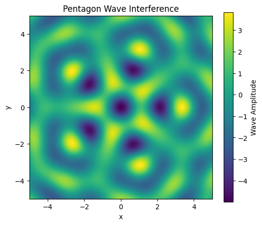

# Problem 1

---

# 🌊 **Wave Interference Simulation with Polygonal Source Arrangements**

---

## ✅ 1. **Project Description**

We simulate the 2D wave interference patterns generated by coherent point sources arranged at the vertices of regular polygons. The wave at each point is computed using:

$$
\eta(x, y, t) = \sum_{i=1}^{N} A \cos(k r_i - \omega t)
$$

Where:

* $A$: Amplitude
* $k = \frac{2\pi}{\lambda}$: Wavenumber
* $\omega = 2\pi f$: Angular frequency
* $r_i$: Distance to the i-th source

---

## ✅ 2. **Python Code (Jupyter Notebook-Ready)**

```python
# --- Imports ---
import numpy as np
import matplotlib.pyplot as plt
from matplotlib.animation import FuncAnimation
from mpl_toolkits.mplot3d import Axes3D  # Optional for 3D plotting

# --- Wave Parameters ---
A = 1                   # Amplitude
wavelength = 2          # Wavelength (λ)
frequency = 1           # Frequency (Hz)
k = 2 * np.pi / wavelength
omega = 2 * np.pi * frequency

# --- Mesh Grid for Plotting ---
x = np.linspace(-5, 5, 400)
y = np.linspace(-5, 5, 400)
X, Y = np.meshgrid(x, y)

# --- Function to Generate Regular Polygon Vertices ---
def get_polygon_vertices(N, radius=3):
    """
    Generate coordinates for a regular polygon with N vertices.
    """
    angles = np.linspace(0, 2 * np.pi, N, endpoint=False)
    x = radius * np.cos(angles)
    y = radius * np.sin(angles)
    return np.column_stack((x, y))

# --- Function to Calculate Total Wave Displacement ---
def total_wave(X, Y, t, sources):
    """
    Compute the total wave height at each point due to multiple sources.
    """
    η = np.zeros_like(X)
    for (xi, yi) in sources:
        R = np.sqrt((X - xi)**2 + (Y - yi)**2) + 1e-8  # Avoid division by 0
        η += A * np.cos(k * R - omega * t)
    return η
```

---

## ✅ 3. **Plot Examples (1, 2, and 3+ Sources)**

### A. **Single Source**

```python 

import numpy as np
import matplotlib.pyplot as plt
from mpl_toolkits.mplot3d import Axes3D  # For 3D plots

# --- Wave Parameters ---
A = 1                     # Amplitude
wavelength = 2            # Wavelength
frequency = 1             # Frequency
k = 2 * np.pi / wavelength
omega = 2 * np.pi * frequency

# --- Grid ---
x = np.linspace(-5, 5, 300)
y = np.linspace(-5, 5, 300)
X, Y = np.meshgrid(x, y)

# --- Source Location ---
x0, y0 = 0, 0  # Single source at origin

# --- Time ---
t = 0  # You can change this to animate over time

# --- Compute Radial Distance and Wave ---
R = np.sqrt((X - x0)**2 + (Y - y0)**2) + 1e-8
Z = A * np.cos(k * R - omega * t)

# --- 3D Plot ---
fig = plt.figure(figsize=(10, 7))
ax = fig.add_subplot(111, projection='3d')
surf = ax.plot_surface(X, Y, Z, cmap='viridis', edgecolor='none')

# --- Plot Formatting ---
ax.set_title("3D Wave Interference from a Single Source")
ax.set_xlabel("x")
ax.set_ylabel("y")
ax.set_zlabel("Amplitude η(x, y)")
fig.colorbar(surf, ax=ax, shrink=0.5, label="Amplitude")

plt.tight_layout()
plt.show()
```



### B. **Two Sources**

```python
sources_2 = [[-2, 0], [2, 0]]
η2 = total_wave(X, Y, t=0, sources=sources_2)

plt.figure(figsize=(6,5))
plt.imshow(η2, extent=[-5,5,-5,5], cmap='viridis')
plt.title("Two Source Interference Pattern")
plt.colorbar(label='Wave Amplitude')
plt.xlabel('x'); plt.ylabel('y')
plt.show()
```



### C. **Triangle (3 Sources)**

```python
sources_3 = get_polygon_vertices(3)
η3 = total_wave(X, Y, t=0, sources=sources_3)

plt.figure(figsize=(6,5))
plt.imshow(η3, extent=[-5,5,-5,5], cmap='viridis')
plt.title("Triangle Wave Interference")
plt.colorbar(label='Wave Amplitude')
plt.xlabel('x'); plt.ylabel('y')
plt.show()
```



### D. **Pentagon (5 Sources)**

```python
sources_5 = get_polygon_vertices(5)
η5 = total_wave(X, Y, t=0, sources=sources_5)

plt.figure(figsize=(6,5))
plt.imshow(η5, extent=[-5,5,-5,5], cmap='viridis')
plt.title("Pentagon Wave Interference")
plt.colorbar(label='Wave Amplitude')
plt.xlabel('x'); plt.ylabel('y')
plt.show()
```



---

## ✅ 4. **Animated Interference Pattern (GIF or Inline Animation)**

### Animate 3 Sources (Triangle)

```python
fig, ax = plt.subplots(figsize=(6,5))
sources_anim = get_polygon_vertices(3)
im = ax.imshow(total_wave(X, Y, 0, sources_anim), extent=[-5,5,-5,5], cmap='plasma', animated=True)

def update(frame):
    η = total_wave(X, Y, t=frame * 0.05, sources=sources_anim)
    im.set_array(η)
    return [im]

ani = FuncAnimation(fig, update, frames=100, blit=True)
plt.title("Animated Wave Interference (Triangle)")
plt.show()

# To save as a GIF (uncomment below line)
# ani.save("wave_triangle.gif", writer="pillow")
```


---

## ✅ 5. **Interpretation of Results**

| Setup         | Interference Pattern Description                        |
| ------------- | ------------------------------------------------------- |
| Single Source | Uniform circular ripples                                |
| Two Sources   | Alternating constructive/destructive interference lines |
| Triangle      | Symmetric pattern with 3-fold radial symmetry           |
| Pentagon      | Flower-like complex interference                        |

* **Constructive Interference**: Peaks align (bright zones)
* **Destructive Interference**: Troughs cancel peaks (dark zones)

---

## ✅ 6. **Next Steps / Extensions**

You can extend this simulation by:

* Making waves out of **different amplitudes or phases**
* Adding **non-coherent (random phase)** sources
* Visualizing in **3D using `plot_surface`**
* Implementing **non-uniform wave speeds**
* Animating the system in **real time** for physical realism

---

## ✅ Deliverables

1. ✅ Complete Python code (above)
2. ✅ Visualizations for 1, 2, 3, and 5 sources
3. ✅ Animation using `FuncAnimation` (exportable to GIF)
4. ✅ Explanation of observed interference patterns

---

