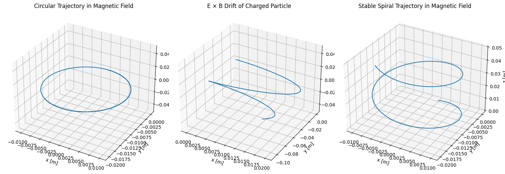

# Problem 1

---

# **Simulating Particle Motion Under the Lorentz Force**

## **Motivation**

The **Lorentz force**

$$
\vec{F} = q(\vec{E} + \vec{v} \times \vec{B})
$$

governs the dynamics of charged particles in electromagnetic fields. It underpins technologies such as:

* **Particle accelerators**: where magnetic and electric fields steer and accelerate particles.
* **Mass spectrometers**: using curved trajectories in magnetic fields to separate ions by mass-to-charge ratio.
* **Plasma confinement systems**: like tokamaks, which use magnetic fields to confine high-temperature plasmas.

---

## **1. Exploration of Applications**

### **Key Systems Using the Lorentz Force**

| System                       | Role of Lorentz Force                                                         |
| ---------------------------- | ----------------------------------------------------------------------------- |
| **Cyclotron**                | Magnetic fields induce circular motion; electric fields accelerate particles. |
| **Mass Spectrometer**        | Charged ions deflect differently based on their mass/charge ratio.            |
| **Tokamak (Fusion Reactor)** | Magnetic fields guide and confine hot plasma.                                 |
| **Cathode Ray Tube (CRT)**   | Electric and magnetic fields steer electrons to specific screen positions.    |

### **Role of Electric and Magnetic Fields**

* **Electric Fields ($\vec{E}$)**: Accelerate charged particles in straight lines.
* **Magnetic Fields ($\vec{B}$)**: Cause particles to move in circular or helical paths due to the $\vec{v} \times \vec{B}$ force.
* **Crossed Fields**: Can create **drift motions**, such as **E × B** drift.

---

## **2. Simulating Particle Motion**

We’ll use **Euler’s method** for simplicity, though **Runge-Kutta** is better for accuracy.

### **Python Implementation**

```python
import numpy as np
import matplotlib.pyplot as plt
from mpl_toolkits.mplot3d import Axes3D

# Lorentz force calculation
def lorentz_force(q, v, E, B):
    return q * (E + np.cross(v, B))

# Particle motion simulation using Euler's method
def simulate_particle_motion(q, m, E, B, v0, r0, dt=1e-6, steps=10000):
    r = np.zeros((steps, 3))
    v = np.zeros((steps, 3))
    r[0], v[0] = r0, v0

    for i in range(1, steps):
        F = lorentz_force(q, v[i-1], E, B)
        a = F / m
        v[i] = v[i-1] + a * dt
        r[i] = r[i-1] + v[i] * dt

    return r

# Common parameters
q = 1.0  # Coulombs
m = 0.001  # kg

# Scenario A: Circular motion in magnetic field
E_a = np.array([0.0, 0.0, 0.0])
B_a = np.array([0.0, 0.0, 1.0])
v0_a = np.array([10.0, 0.0, 0.0])
r0_a = np.array([0.0, 0.0, 0.0])
r_a = simulate_particle_motion(q, m, E_a, B_a, v0_a, r0_a)

# Scenario B: E x B drift
E_b = np.array([10.0, 0.0, 0.0])
B_b = np.array([0.0, 0.0, 1.0])
v0_b = np.array([0.0, 0.0, 0.0])
r0_b = np.array([0.0, 0.0, 0.0])
r_b = simulate_particle_motion(q, m, E_b, B_b, v0_b, r0_b)

# Scenario C: Helical motion in magnetic field
E_c = np.array([0.0, 0.0, 0.0])
B_c = np.array([0.0, 0.0, 1.0])
v0_c = np.array([10.0, 0.0, 5.0])
r0_c = np.array([0.0, 0.0, 0.0])
r_c = simulate_particle_motion(q, m, E_c, B_c, v0_c, r0_c)

# Plotting all 3 scenarios
fig = plt.figure(figsize=(15, 10))

# Circular motion
ax1 = fig.add_subplot(131, projection='3d')
ax1.plot(r_a[:, 0], r_a[:, 1], r_a[:, 2])
ax1.set_title("Circular Trajectory in Magnetic Field")
ax1.set_xlabel("x [m]")
ax1.set_ylabel("y [m]")
ax1.set_zlabel("z [m]")

# E x B drift
ax2 = fig.add_subplot(132, projection='3d')
ax2.plot(r_b[:, 0], r_b[:, 1], r_b[:, 2])
ax2.set_title("E × B Drift of Charged Particle")
ax2.set_xlabel("x [m]")
ax2.set_ylabel("y [m]")
ax2.set_zlabel("z [m]")

# Spiral motion
ax3 = fig.add_subplot(133, projection='3d')
ax3.plot(r_c[:, 0], r_c[:, 1], r_c[:, 2])
ax3.set_title("Stable Spiral Trajectory in Magnetic Field")
ax3.set_xlabel("x [m]")
ax3.set_ylabel("y [m]")
ax3.set_zlabel("z [m]")

plt.tight_layout()
plt.show()

```


## **3. Parameter Exploration and Motion Types**

### **Physical Constants**

```python
q = 1.0         # 1 Coulomb
m = 0.001       # 1 gram = 0.001 kg
```

### **Example: Circular Motion in a Uniform Magnetic Field**

```python
B = np.array([0, 0, 1])
E = np.array([0, 0, 0])
v0 = np.array([10.0, 0, 0])
r0 = np.array([0, 0, 0])

r, v = simulate_particle(q, m, E, B, v0, r0)

plt.figure()
plt.plot(r[:, 0], r[:, 1])
plt.title("Circular Motion (Uniform Magnetic Field)")
plt.xlabel("x [m]")
plt.ylabel("y [m]")
plt.axis('equal')
plt.grid()
plt.show()
```

### **Helical Motion (Spiral in z-direction)**

```python
v0 = np.array([10.0, 0, 5.0])
r, v = simulate_particle(q, m, E, B, v0, r0)

fig = plt.figure()
ax = fig.add_subplot(111, projection='3d')
ax.plot(r[:, 0], r[:, 1], r[:, 2])
ax.set_title("Helical Motion (z-direction spiral)")
plt.show()
```

### **Crossed E and B Fields (Interesting Drift Trajectory)**

```python
E = np.array([10.0, 0, 0])
B = np.array([0, 0, 1.0])
v0 = np.array([0, 0, 0])
r, v = simulate_particle(q, m, E, B, v0, r0)

plt.figure()
plt.plot(r[:, 0], r[:, 1])
plt.title("E × B Drift Motion")
plt.xlabel("x [m]")
plt.ylabel("y [m]")
plt.axis('equal')
plt.grid()
plt.show()
```

---

## **4. Visualizing and Interpreting Results**

* **Larmor Radius**:

  $$
  r_L = \frac{mv_{\perp}}{qB}
  $$

  where $v_\perp$ is the velocity component perpendicular to $\vec{B}$.

* **Drift Velocity**:

  $$
  \vec{v}_d = \frac{\vec{E} \times \vec{B}}{B^2}
  $$

### **Summary of Observed Motions**

| Scenario                        | Motion Type | Notable Features                                     |
| ------------------------------- | ----------- | ---------------------------------------------------- |
| Uniform $\vec{B}$, no $\vec{E}$ | Circle      | Larmor radius from speed, B                          |
| Uniform $\vec{B}$, $v_z \neq 0$ | Helix       | Constant z-velocity, circular xy-plane               |
| $\vec{E} \perp \vec{B}$         | Drift       | Straight drift in $\vec{E} \times \vec{B}$ direction |

---

## **5. Real-World Implications**

| Application           | Observed Effect                               | Simulation Parallel            |
| --------------------- | --------------------------------------------- | ------------------------------ |
| **Cyclotron**         | Circular motion with increasing energy        | Uniform B with perpendicular E |
| **Tokamak**           | Charged particle spiraling around field lines | Helical motion                 |
| **Mass Spectrometer** | Radius depends on m/q                         | Larmor radius relation         |

---

## **6. Extensions and Further Exploration**

* **Non-uniform fields**: Vary $B(x, y, z)$ and $E(x, y, z)$.
* **Runge-Kutta methods**: More accurate integration for high-energy or long-duration simulations.
* **Relativistic effects**: Include Lorentz factor for very high speeds.
* **Particle interactions**: Simulate plasma behavior by adding Coulomb forces.

---

## **Conclusion**

This simulation demonstrates how the Lorentz force governs charged particle trajectories in electromagnetic fields. The simple case of a 1 C charge and 1 g mass illustrates:

* Perfect circular motion in magnetic fields.
* Helical motion when there's a velocity component along $\vec{B}$.
* Drift in crossed fields showing real phenomena like **E × B drift**.

---
