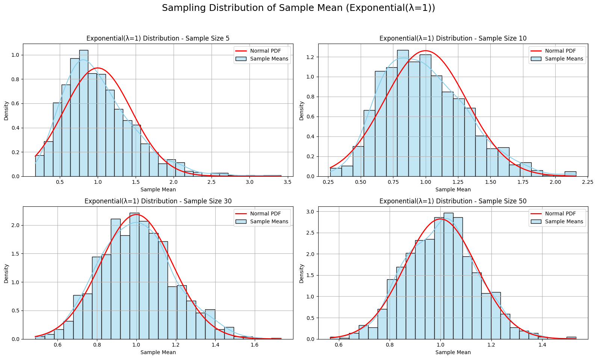
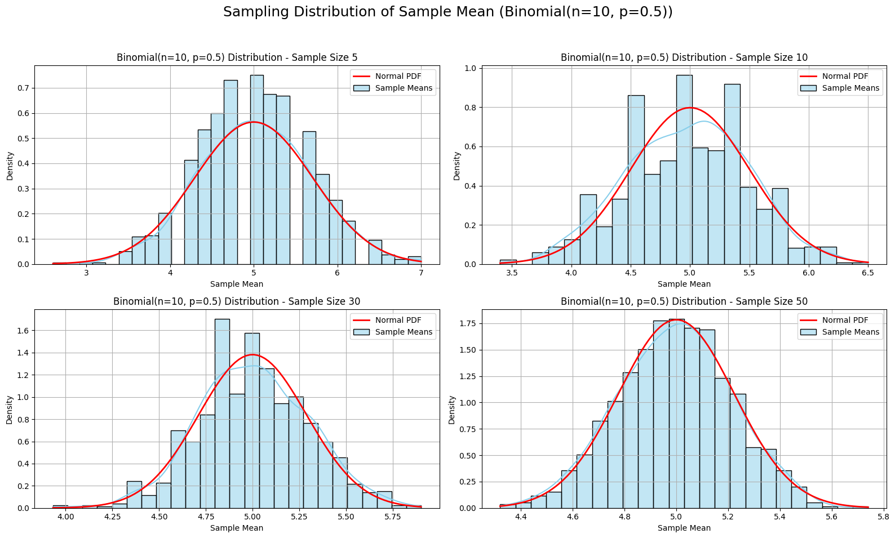

# Problem 1
Here's an updated, detailed, and polished version of your **Statistics Project** combining the **Central Limit Theorem (CLT)** and **Pi Simulation** problems. This version includes definitions, visualizations, convergence analysis, and structure for a high-quality report or notebook.

---

## 🧮 Statistics Project: CLT & Pi Simulation

---

## 📘 Part 1: Exploring the Central Limit Theorem (CLT) through Simulations

### 🔍 Objective

To visually and computationally explore the Central Limit Theorem using simulations from various probability distributions and demonstrate how the sample mean converges to a normal distribution as sample size increases.

---

### 📖 Definitions

* **Central Limit Theorem (CLT):** States that, for a sufficiently large sample size, the distribution of the sample mean of any independent, identically distributed (i.i.d.) random variables approaches a normal distribution, regardless of the original population’s distribution.

* **Sample Mean ($\bar{X}$)**:

  $$
  \bar{X} = \frac{1}{n} \sum_{i=1}^n X_i
  $$

  The average value from a random sample of $n$ observations.

* **Population Distribution:** The original distribution from which we draw samples (e.g., Uniform, Exponential, Binomial).

---

### ⚙️ Methodology

* Choose three distributions: **Uniform**, **Exponential**, **Binomial**
* For each, simulate the population with 100,000 data points.
* Randomly draw multiple samples of size $n = 5, 10, 30, 50$
* Repeat 1000 times for each sample size and distribution
* Plot histograms of the sample means
* Overlay a normal distribution curve for comparison
* Analyze convergence visually and quantitatively

---

### 📊 Code with Visualizations and Definitions

```python
import numpy as np
import matplotlib.pyplot as plt
import seaborn as sns
from scipy.stats import norm

def plot_sampling_distribution(dist_name, sample_means, mu, sigma, n):
    sns.histplot(sample_means, kde=True, stat="density", color="skyblue", label="Sample Means")
    x = np.linspace(min(sample_means), max(sample_means), 100)
    plt.plot(x, norm.pdf(x, mu, sigma/np.sqrt(n)), color='red', lw=2, label="Normal PDF")
    plt.title(f'{dist_name} Distribution - Sample Size {n}')
    plt.xlabel('Sample Mean')
    plt.ylabel('Density')
    plt.legend()
    plt.grid(True)

def simulate_clt(pop_func, args, label, true_mu, true_sigma):
    sample_sizes = [5, 10, 30, 50]
    plt.figure(figsize=(16, 10))
    plt.suptitle(f'Sampling Distribution of Sample Mean ({label})', fontsize=18)

    for i, n in enumerate(sample_sizes):
        means = [np.mean(pop_func(*args, n)) for _ in range(1000)]
        plt.subplot(2, 2, i + 1)
        plot_sampling_distribution(label, means, true_mu, true_sigma, n)

    plt.tight_layout(rect=[0, 0.03, 1, 0.95])
    plt.show()

# Uniform [0,1]
simulate_clt(np.random.uniform, (0, 1), 'Uniform[0,1]', 0.5, np.sqrt(1/12))

# Exponential (λ=1)
simulate_clt(np.random.exponential, (1,), 'Exponential(λ=1)', 1.0, 1.0)

# Binomial (n=10, p=0.5)
simulate_clt(np.random.binomial, (10, 0.5), 'Binomial(n=10, p=0.5)', 5.0, np.sqrt(10*0.5*0.5))
```







---

### 🧠 Analysis

* **Uniform Distribution**: Converges quickly due to symmetry and finite bounds.
* **Exponential Distribution**: Skewed and unbounded—requires larger $n$ for normality to emerge.
* **Binomial Distribution**: Discrete but symmetric here—converges moderately well.

✅ **Observation**: As sample size increases, histograms become more bell-shaped and closer to the red normal curve, confirming the CLT.

---

### 🌍 Real-World Applications of CLT

* **Surveys**: Estimating population averages from samples
* **Manufacturing**: Analyzing sample means in quality control
* **Finance**: Modeling returns aggregated over time intervals

---


