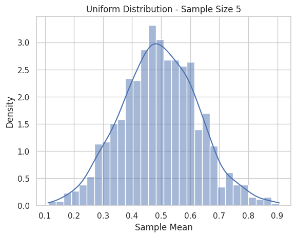
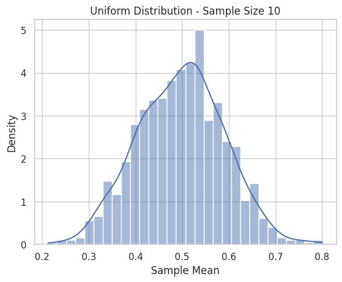
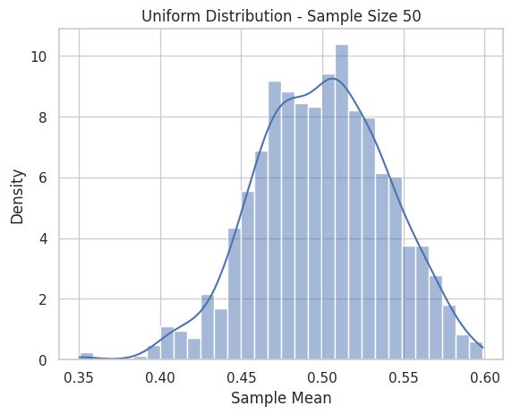

# Problem 1

---

## 📘 Exploring the Central Limit Theorem through Simulations

### 🎯 Motivation

The **Central Limit Theorem (CLT)** asserts that the sampling distribution of the sample mean tends toward a **normal distribution**, even when the underlying population distribution is not normal, as long as the sample size is sufficiently large. This simulation-based project allows us to witness this powerful result across different population distributions.

---

### 📊 1. Simulating Sampling Distributions

We'll consider three population distributions:

* **Uniform Distribution**: $U(a, b)$
* **Exponential Distribution**: $\text{Exp}(\lambda)$
* **Binomial Distribution**: $\text{Bin}(n, p)$

```python
import numpy as np
import matplotlib.pyplot as plt
import seaborn as sns

sns.set(style="whitegrid")
np.random.seed(42)  # for reproducibility

# Generate population datasets
population_size = 100_000

uniform_pop = np.random.uniform(0, 1, population_size)
exponential_pop = np.random.exponential(scale=1.0, size=population_size)
binomial_pop = np.random.binomial(n=10, p=0.5, size=population_size)
```

---

### 📈 2. Sampling and Visualization

We sample from each population and compute the sample mean for varying sample sizes.

```python
def generate_sample_means(population, sample_size, n_samples=1000):
    return [np.mean(np.random.choice(population, sample_size)) for _ in range(n_samples)]

def plot_sampling_distribution(sample_means, title):
    sns.histplot(sample_means, kde=True, stat="density", bins=30)
    plt.title(title)
    plt.xlabel('Sample Mean')
    plt.ylabel('Density')
    plt.show()
```

```python
sample_sizes = [5, 10, 30, 50]

distributions = {
    "Uniform": uniform_pop,
    "Exponential": exponential_pop,
    "Binomial": binomial_pop
}

for dist_name, population in distributions.items():
    for size in sample_sizes:
        means = generate_sample_means(population, sample_size=size)
        plot_sampling_distribution(means, f"{dist_name} Distribution - Sample Size {size}")
```






---

### 🔍 3. Parameter Exploration

We can visualize how the **spread (variance)** of the sampling distribution 
 as sample size increases and how the **shape** tends toward normality.

```python
import pandas as pd

summary = []

for dist_name, population in distributions.items():
    for size in sample_sizes:
        means = generate_sample_means(population, sample_size=size)
        summary.append({
            "Distribution": dist_name,
            "Sample Size": size,
            "Mean of Sample Means": np.mean(means),
            "Std of Sample Means": np.std(means)
        })

df_summary = pd.DataFrame(summary)
print(df_summary)
```


#### Observations:

* The **standard deviation** of the sample mean decreases as sample size increases, confirming that larger samples give more stable estimates.
* Even **skewed distributions** (like exponential) show normality in the sampling mean as sample size increases.

---

### 🛠️ 4. Practical Applications of CLT

#### **Estimation of Population Parameters**

* CLT allows the use of sample means to estimate population means with known confidence intervals.

#### **Quality Control**

* Manufacturers monitor sample means from production lines to detect anomalies or drifts.

#### **Finance**

* Portfolio returns over time are often modeled using the normal distribution due to the CLT.

---

### 📌 Conclusion

Through simulations, we observed:

* The **robustness** of the CLT across distributions.
* How **sample size** affects the convergence to normality.
* How the **spread** of the sampling distribution shrinks with larger samples.

This highlights the CLT’s central role in statistical inference, allowing probabilistic statements even when the original data are non-normal.

---

### 📎 Resources

* NumPy Documentation: [https://numpy.org/doc/](https://numpy.org/doc/)
* Seaborn Visualization: [https://seaborn.pydata.org/](https://seaborn.pydata.org/)
* CLT Explanation (Khan Academy): [https://www.khanacademy.org/math/statistics-probability/sampling-distributions-library](https://www.khanacademy.org/math/statistics-probability/sampling-distributions-library)

---


